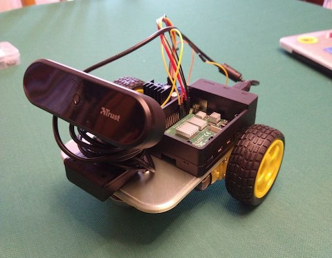

# EDU4AI - Autonomous Driving Cars

This tutorial is part of the following EU funded project:

Edu4AI - Artificial Intelligence and Machine Learning to Foster 21st Century Skills in Secondary Education, in the framework of Erasmus+, Grant Agreement VG-IN-BY-20-25-077366


# Final result


# Get the parts
For our project we used the following parts
- [ ] Raspberry Pi version 4
- [ ] MicroSD card minimum size 16 GB
- [ ] Two wheels with rubber tires
- [ ] L298N Motor Drive Controller
- [ ] USB 5V power bank, with at least 2.5A power output (USB-C)
- [ ] 9V battery with clip
- [ ] USB webcam with hole for tripod
- [ ] Jumper wires F/F and F/M, to connect everything
- [ ] M2.5 and M3 screws, assorted lengths
- [ ] double-sided tape or Patafix
- [ ] 1/4" slotted screw (for camera)
- [ ] ball castor (we used a two-holes ball castor, with distance of 38mm between them)
- [ ] a micro-HDMI to HDMI cable or adapter to connect your Raspberry to a monitor

Optional:
- [ ] Raspberry case

Just as reference, you can see the list part [here](https://www.amazon.it/hz/wishlist/ls/2XP57TFXQNB8H?ref_=wl_share).

## Chassis
For the chassis, we created [this](https://cad.onshape.com/documents/15c321ccd0213a232c1b2dd5/w/b4b8e765f4b619d71b8de61f/e/8b93bb84c32f0defb354983d?renderMode=0&uiState=627d060678688a1df5b7ed36) project using OnShape. OnShape is a completely online CAD, free to use for students and educators. 

We printed the chassis with common PLA. 

The chassis is far to be perfect, could be largely improved. We favored simplicity for 3D printing, using a single part and a flat side to adhere to the build plate. Please feel free to modify it according to your needs.

# L298N <-> Raspberry Pi GPIO pins

| L298N | Raspberry PI GPIO PIN | Raspberry Pi pin description |
|---|---|---|
| IN1 | 29 | GPIO5 |
| IN2 | 31 | GPIO6 |
| IN3 | 37 | GPIO26 |
| IN4 | 36 | GPIO16 |
| GND | 39 | GND |

# Prepare the SD Card
We used the official [Raspberry Pi OS](https://www.raspberrypi.com/software/operating-systems/).

We tested the project with:
- Raspberry Pi OS with desktop
- Release date: April 4th 2022
- System: 32-bit
- Kernel version: 5.15
- Debian version: 11 (bullseye)

# Set up the Raspberry Pi

Connect a mouse, keyboard and monitor to your Raspberry Pi and power it. Follow configuration and initialisation instructions if any.
To upgrade the Operating System, open a Terminal window and execute:

```sh
sudo apt update
sudo apt -y dist-upgrade
```

Answer 'yes' to any prompts.

Now we should install VNC (Virtual Network Computing) to access the Robot remotely using our Windows laptop.

Install VNC server on the Raspberry Pi

```sh
sudo apt update
sudo apt install realvnc-vnc-server
```

Then from the Pi menu enable the VNC by:
Raspberry Pi Menu->Preferences->Raspberry Pi Configuration->Interface tab->Enable VNC and click OK.

After that you should install a VNC viewer on your Windows laptop; you can download it [here](https://www.realvnc.com/en/connect/download/viewer/).

Get the IP from the Raspberry using:

```sh
hostname -I
```

Put this IP into the VNC viewer on your laptop.


# Move the motors

```py
from gpiozero import Robot
myRobot = Robot(right=(26,16), left=(5,6))

# Argument is the speed, from 0 (stop) to 1 (max speed, default)
# Leave empty for default

myRobot.forward(0.6)  # go forward
myRobot.backward(0.6) # go backward
myRobot.left(0.6) # turn left
myRobot.right(0.6) # turn right
```

# Train your model
Go to [Teachable Machine](https://teachablemachine.withgoogle.com/train).

Use "Standard Image Model"

After training, export as Tensorflow Lite -> Quantized

# Test trained model with your car

Open a terminal on Raspberry Pi and install dependencies.

```sh
sudo apt update
sudo apt -y install libjpeg-dev libtiff5-dev libjasper-dev libpng-dev
sudo apt -y install libavcodec-dev libavformat-dev libswscale-dev libv4l-dev
sudo apt -y install libxvidcore-dev libx264-dev
sudo apt -y install libatlas-base-dev

pip3 install opencv-python

pip3 install tflite-runtime

pip3 install numpy --upgrade
```

Create a folder on Raspberry, unzip the Tensorflow model and download the [classify_webcam.py](classify_webcam.py) example inside it.

Inside a terminal, test that everything works:

```sh
python3 classify_webcam.py --model myModel/model.tflite -–labels myModel/labels.txt
```


